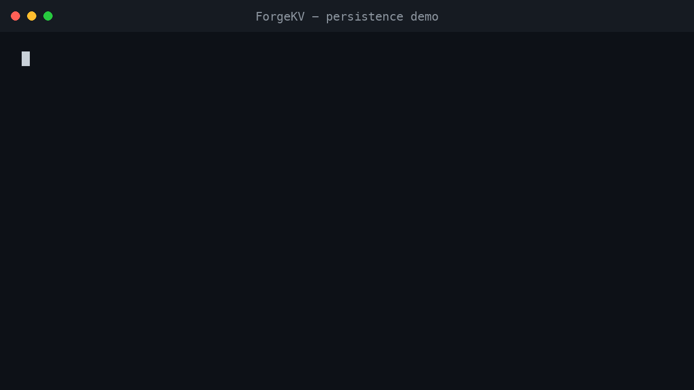
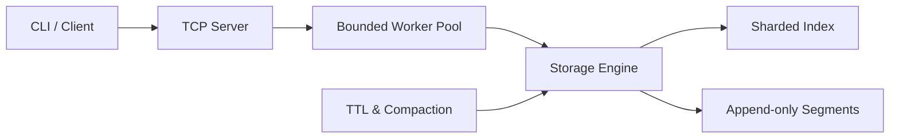

# ForgeKV

**A persistent key-value server built from scratch in C++20, with TCP networking, concurrent request handling, and crash recovery.**

[](https://github.com/meetsutariya4448/ForgeKV/actions/workflows/ci.yml)


ForgeKV accepts `PUT`, `GET`, `DELETE`, expiration, health, and statistics commands through a
versioned binary protocol. It stores data in its own checksummed, append-only segment format and
rebuilds its in-memory index when the server restarts.

## Demo



The recording starts a server, writes and reads a value, stops the process, restarts it with the
same data directory, and reads the persisted value again. The equivalent commands are:

```sh
# Terminal 1
./build/forgekv-server --data ./forgekv-demo-data --durability always

# Terminal 2
./build/forgekv-cli 127.0.0.1 7391 PUT greeting persisted-value
# OK
./build/forgekv-cli 127.0.0.1 7391 GET greeting
# persisted-value

# Stop Terminal 1 with Ctrl-C, restart the same server command, then run:
./build/forgekv-cli 127.0.0.1 7391 GET greeting
# persisted-value
```

## Architecture



Detailed locking, recovery, compaction, and replication-model diagrams live in the
[architecture documentation](docs/ARCHITECTURE.md).

## Engineering highlights

- **Persistence:** Versioned records carry header and payload checksums. Recovery keeps complete
  acknowledged data, removes an incomplete active tail, and reports complete-record corruption.
- **Concurrency:** Connections, queued work, and workers are bounded. Independently locked index
  shards allow concurrent lookups, while a process-level lock prevents two servers from mutating
  the same data directory.
- **Storage maintenance:** Expiring keys are tracked by deadline, active segments rotate at a
  configured size, and compaction reclaims obsolete records without allowing stale copies to
  overwrite concurrent changes.
- **Validation:** Unit, integration, crash, concurrency, and model-stress tests run on Linux and
  macOS; Linux jobs additionally exercise address, undefined-behavior, and thread sanitizers plus
  fuzzing of storage and protocol parsers.

## Quickstart

Prerequisites: Git, CMake 3.24 or newer, a C++20 compiler, and network access during the first
configuration so CMake can fetch the pinned GoogleTest dependency. Linux and macOS are exercised
by CI.

```sh
git clone https://github.com/meetsutariya4448/ForgeKV.git
cd ForgeKV
cmake -S . -B build -DCMAKE_BUILD_TYPE=Release
cmake --build build --parallel
```

Start the server. Here `--durability always` synchronizes each acknowledged mutation, and data is
stored beneath `./forgekv-data` relative to the directory where the command runs.

```sh
./build/forgekv-server --host 127.0.0.1 --port 7391 \
  --data ./forgekv-data --durability always
```

In another terminal, write and retrieve a value:

```sh
./build/forgekv-cli 127.0.0.1 7391 PUT greeting hello
./build/forgekv-cli 127.0.0.1 7391 GET greeting
```

Run the complete test suite:

```sh
ctest --test-dir build --output-on-failure
```

## Performance finding

Linux profiling identified a small-response TCP buffering delay. Enabling `TCP_NODELAY` produced
the following focused comparison:

| Read-only loopback benchmark | Before | After `TCP_NODELAY` |
|---|---:|---:|
| Median p99 batch latency | 49.2 ms | 0.99 ms |

This was five alternating trials in a Docker Desktop Linux VM: 100% GET, durability `none`, 1,000
keys in one segment, 128-byte values, 16 connections, four workers, pipeline depth four, and six
seconds per trial. It is evidence for the TCP buffering diagnosis—not a general capacity claim or
comparison with other databases. See the [methodology](docs/BENCHMARKING.md#optimization-discipline)
and [recorded comparison](bench/raw/profile-read-heavy-tcp-nodelay-comparison-20260905T220859Z-6143f5a79676/comparison-summary.json).

## Validation and scope

**Validation:** 126 tests passed in each final hosted Release and sanitizer configuration; both
parser fuzzers completed 10,000 runs. See the
[exact GitHub Actions run](https://github.com/meetsutariya4448/ForgeKV/actions/runs/34045003048).

**Scope:** The working server is single-node. Consistent-hashing and replication components are
separate in-process library models, not a deployed cluster. Durability depends on the selected
synchronization mode. See the [full limitations](docs/LIMITATIONS.md).

## Documentation

| Document | What it explains |
|---|---|
| [Architecture](docs/ARCHITECTURE.md) | Components, ownership, and request flow |
| [Storage format](docs/STORAGE_FORMAT.md) | Records, checksums, recovery, and durability |
| [Benchmarks](docs/BENCHMARKING.md) | Methodology, profiling, and raw results |
| [Limitations](docs/LIMITATIONS.md) | Guarantees and unsupported behavior |
